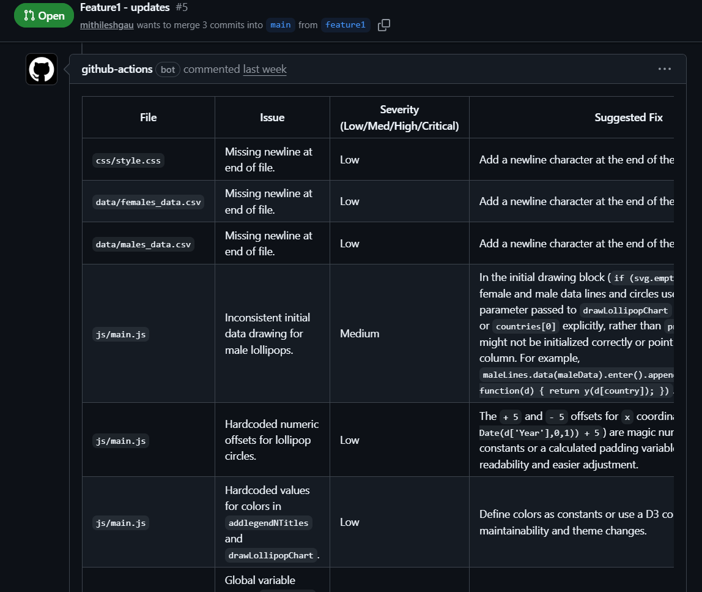

# Code Review Agent - Central Hub

This repository contains the **Code Review Agent**, an automated code review tool powered by the **Google Gemini API**. It provides architectural, security, and quality reviews directly within your GitHub Pull Requests. While designed for enterprise-scale management, it is a focused agent for high-quality, AI-driven code reviews.

## What's in this Hub?

1. **`action.yml`**: The interface for our agent. It calls the Google Gemini API, gathers the PR diff, executes the review, and posts the results back to the PR using the GitHub CLI.
2. **`AGENTS.md`**: The "brain" of the agent. It defines the persona (Senior Architect), the task (reviewing git diffs for architectural violations, code quality, and security), and formatting rules. All consuming repositories will use these exact rules.

---

## Example Review

Here is an example of the feedback provided by the **Code Review Agent**:



---

## How to Use This Agent in Another Repository

Any repository within our organization can opt-in to automated architectural and security reviews by consuming this composite action.

### Prerequisites

1.  **Repository Access**: Ensure this Hub Repository (`Code-Review-Agent` or `ai-reviewer-action`) has **Access** enabled in its Actions General Settings so that other repositories in the organization can use it.
2.  **API Key**: The consuming repository (or the organization) must have a Google Gemini API Key saved as a GitHub Secret (e.g., `GOOGLE_API_KEY`). You can get one from [Google AI Studio](https://aistudio.google.com/).

### Configuration (Consuming Repo)

In the repository where you want the reviews to happen, create a new GitHub Actions workflow file:

`.github/workflows/ai-architect-review.yml`

Paste the following configuration:

```yaml
name: "AI Architect Review"

on:
  pull_request:
    types: [opened, synchronize, reopened]

jobs:
  ai-review:
    runs-on: ubuntu-latest
    permissions:
      contents: read
      pull-requests: write # Required for the agent to post the review comment
      issues: write        # Required for certain OpenCode operations
      id-token: write     # REQUIRED: Required for OIDC token authentication
    
    steps:
      - name: Checkout Code
        uses: actions/checkout@v4
        with:
          # Important: Fetch depth 0 to ensure the diff can be generated properly
          fetch-depth: 0 

      - name: Run Code Review Agent
        # Replace 'your-organization-name/Code-Review-Agent' with the actual org/repo name of this Hub
        uses: your-organization-name/Code-Review-Agent@main
        with:
          # Pass the API key securely from the consuming repo's secrets
          google_api_key: ${{ secrets.GOOGLE_API_KEY }}
          # Optional: Choose 'standard', 'deep', or 'security' (defaults to 'standard')
          review_depth: 'deep'
```

### Supported Inputs

When using the action (`uses: ...`), you can configure the following `with:` inputs:

| Input | Description | Required | Default |
| :--- | :--- | :--- | :--- |
| `google_api_key` | The API key for Google Gemini. Securely pass this using `${{ secrets... }}`. | **Yes** | - |
| `review_depth` | How deep to review. Valid options: `standard`, `deep`, `security`. | No | `standard` |

## Modifying the Agent's Behavior

To update how the AI architect reviews code across the *entire organization*, simply modify the `AGENTS.md` file in this central repository. 

The next time any consuming repository runs its workflow, it will automatically use the updated, organization-approved rules!
